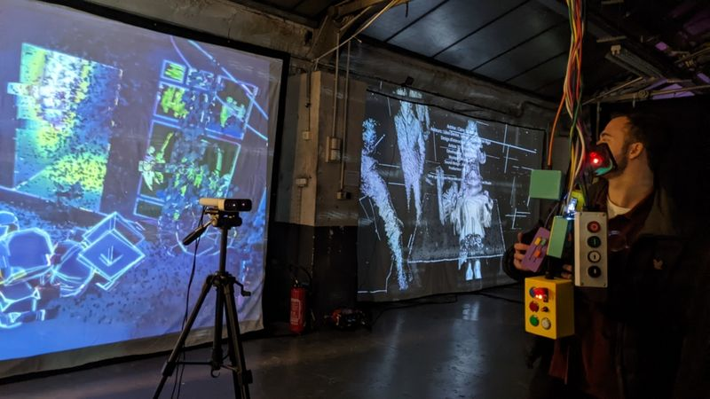

## Miroir Arcade

*with Dorian Rigal and Emilie Breslavetz* 

Miroir Arcade is an interactive multiplayer projection controlled by a cluster of handcrafted gamepads. The visitor sees their body projected into the digital space through a Kinect camera. Mysterious hanging boxes in space can generate spectacular effects. By sharing the controls, the participants manipulate buttons, potentiometers and switches to discover all the distorting filters.  

[video](https://vimeo.com/691949659) + [project page](https://gamaelstrom.com/projects/miroir-arcade/)

## Calculateur Particulier

*with Dorian Rigal* 

<video autoplay muted loop src="media/video/project/fractal-raspi.mp4"></video>

Reflection of a computer tower whose screen facade opens like a portal, inviting the viewer to approach the heart of the machine. The duo of the screen and the central unit become one. It forms a digital sculpture on which content calculated in real time is displayed. Generated by graphic code, the screen projects fractal animations.

[video](https://vimeo.com/694579050) + [project page](https://www.minuitdigital.com/Galerie-Publication/Calculateur-Particulier)

## Frequency - electronic dance battle

*with Dorian Rigal and Anna Bacheva* 

<video autoplay muted loop src="media/video/project/frequency.mp4"></video>

Visual show with real time animation effects for Frequency electronic dance battle show at Gaité Lyrique.

## Heterotopia - Les espaces rêvés du Grand Paris

*with Dorian Rigal, Flore Morfin and Achraf Jendane Bouzefour* 

<video autoplay muted loop src="media/video/project/heterotopia-city.mp4"></video>

“The dream spaces of Greater Paris” is a performative short film. It is part of the Heterotopia series of works, which explores the spaces capable of connecting us to our utopias. The idea is to open the border that exists between the work and the viewer by inviting him to enter the screen. For this, Neon Minuit uses video game tools to produce an interactive animated image.

[video](https://vimeo.com/655294472) + [project page](https://www.minuitdigital.com/Interactive-Installation/Heterotopia-2021)